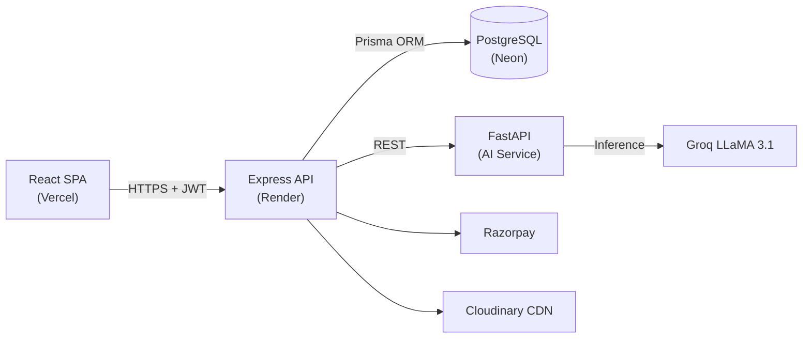
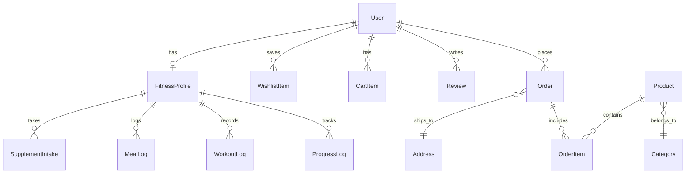

<h1 align="center">🦾 AlphaPowerZone (APZ)</h1>
<p align="center"><b>A Full-Stack Fitness Supplement E-Commerce Platform with AI-Powered Coaching</b></p>

<p align="center">
  
  
  
  
  
</p>

<p align="center">
  🔗 <a href="https://alpha-power-zone-apz.vercel.app/"><b>Live Demo</b></a> &nbsp;·&nbsp;
  📦 <a href="https://github.com/gitxpriyanshu/AlphaPowerZone---APZ"><b>Repository</b></a>
</p>

---

## 💡 What is APZ?

AlphaPowerZone is a **production-grade, three-service application** that combines a premium supplement storefront, an administrative command center, and an AI fitness microservice — built from scratch with modern full-stack technologies.

| Service | Stack | Deployed On |
|:--------|:------|:------------|
| Frontend | React 19, Vite, Tailwind CSS v4, Framer Motion | Vercel |
| Backend API | Node.js, Express 5, Prisma ORM, Zod | Render |
| AI Service | Python, FastAPI, Groq LLaMA 3.1 70B | Render |
| Database | PostgreSQL (15 models) | Neon |

---

## ⚡ Core Features

**🛒 E-Commerce**
- Full product catalog with search, filters, categories, and pagination
- Razorpay payment gateway (INR) with order verification
- Complete order lifecycle: `Pending → Confirmed → Shipped → Delivered`
- Wishlist, cart (server-synced via Zustand + TanStack Query), and reviews

**🤖 AI Fitness Intelligence**
- BMI analysis and personalized training/nutrition plans
- Progress tracking (weight, workouts, meals, supplements)
- Powered by Groq + LLaMA 3.1 70B for real-time AI responses

**🕹️ Admin Dashboard**
- Revenue analytics, profit tracking (wholesale vs. selling price)
- Product CRUD with Cloudinary image uploads
- Order management and user oversight with Recharts visualizations

**🔐 Security**
- Dual JWT auth (User + Owner) with role-based route protection
- Helmet, CORS whitelisting, rate limiting, Zod validation

---

## 🏗️ Architecture



---

## 🗄️ Database Schema (15 Models)



`User` · `Owner` · `Product` · `Category` · `Order` · `OrderItem` · `CartItem` · `WishlistItem` · `Review` · `Address` · `FitnessProfile` · `ProgressLog` · `WorkoutLog` · `MealLog` · `SupplementIntake`

---

## 📡 API Endpoints

All routes prefixed with `/api/v1`. Auth: 🔒 = JWT required.

| Module | Key Endpoints | Auth |
|:-------|:-------------|:-----|
| **Auth** | `POST /auth/register` · `POST /auth/login` · `GET /auth/me` | — / 🔒 |
| **Products** | `GET /products` · `GET /products/:slug` · `POST/PUT/DELETE /products/:id` | — / 🔒 Owner |
| **Orders** | `GET /orders` · `PATCH /orders/:id/status` · `PATCH /orders/:id/cancel` | 🔒 |
| **Payments** | `POST /payments/create-order` · `POST /payments/verify` | 🔒 |
| **Reviews** | `GET /reviews/:productId` · `POST/PUT/DELETE /reviews/:id` | — / 🔒 |
| **Wishlist** | `GET /wishlist` · `POST/DELETE /wishlist/:productId` | 🔒 |
| **Fitness AI** | `POST /fitness/analyze` · `GET /tracker/profile` · `POST /tracker/progress` | 🔒 |
| **Analytics** | `GET /analytics/overview` · `GET /analytics/revenue` | 🔒 Owner |
| **Utilities** | `GET /pincode/:pincode` · `GET /sitemap.xml` | — |

---

## 📁 Project Structure

```
AlphaPowerZone---APZ/
├── frontend/                 # React 19 + Vite + Tailwind CSS v4
│   ├── src/
│   │   ├── pages/            # 21 page components (Home, Shop, Checkout, FitnessAI, OwnerDashboard...)
│   │   ├── components/       # Reusable UI (Navbar, Footer, ProductCard, CartDrawer...)
│   │   ├── hooks/            # Custom hooks (useProducts, useAuth...)
│   │   ├── stores/           # Zustand state management
│   │   └── lib/              # Axios client & utilities
│   └── vite.config.ts
│
├── backend/                  # Node.js + Express 5 + Prisma
│   ├── prisma/schema.prisma  # 15 database models
│   ├── src/
│   │   ├── controllers/      # 12 route handlers
│   │   ├── services/         # Business logic layer
│   │   ├── middlewares/      # Auth, validation, error handling
│   │   ├── routes/           # 13 route files
│   │   └── validators/       # Zod schemas
│   ├── app.ts
│   └── server.ts
│
├── ai-service/               # Python + FastAPI + Groq
│   ├── routers/              # API routes
│   ├── services/             # LLM integration
│   ├── main.py               # Entry point
│   └── Dockerfile
│
├── vercel.json               # Frontend deploy config
└── render.yaml               # Backend deploy config (IaC)
```

---

## 🚀 Quick Start

```bash
# 1. Clone
git clone https://github.com/gitxpriyanshu/AlphaPowerZone---APZ.git && cd AlphaPowerZone---APZ

# 2. Backend
cd backend && npm install && cp .env.example .env
npx prisma generate && npx prisma db push && npm run dev

# 3. Frontend (new terminal)
cd frontend && npm install && cp .env.example .env && npm run dev

# 4. AI Service (new terminal, optional)
cd ai-service && python -m venv venv && source venv/bin/activate
pip install -r requirements.txt && cp .env.example .env && uvicorn main:app --reload
```

### Environment Variables

<details>
<summary><b>Backend</b> (<code>backend/.env</code>)</summary>

| Variable | Description |
|:---------|:------------|
| `DATABASE_URL` | PostgreSQL connection string |
| `JWT_SECRET` | Min 32-char token signing secret |
| `NODE_ENV` | `development` / `production` |
| `CORS_ORIGIN` / `FRONTEND_URL` | Frontend origin for CORS |
| `CLOUDINARY_CLOUD_NAME` / `API_KEY` / `API_SECRET` | Image CDN credentials |
| `RAZORPAY_KEY_ID` / `KEY_SECRET` | Payment gateway credentials |
| `PYTHON_AI_SERVICE_URL` | AI microservice URL |

</details>

<details>
<summary><b>Frontend</b> (<code>frontend/.env</code>)</summary>

| Variable | Description |
|:---------|:------------|
| `VITE_API_URL` | Backend API base URL |
| `VITE_RAZORPAY_KEY_ID` | Razorpay public key |

</details>

<details>
<summary><b>AI Service</b> (<code>ai-service/.env</code>)</summary>

| Variable | Description |
|:---------|:------------|
| `GROQ_API_KEY` | Groq API key for LLaMA inference |
| `AI_SERVICE_API_KEY` | Shared auth key (must match backend) |

</details>

---

## ☁️ Deployment

| Service | Platform | Build Command | Start Command |
|:--------|:---------|:-------------|:--------------|
| Frontend | **Vercel** | `npm run build` | — (static) |
| Backend | **Render** | `npm install && npm run build` | `npm start` |
| AI Service | **Render** | `pip install -r requirements.txt` | `uvicorn main:app --host 0.0.0.0 --port $PORT` |
| Database | **Neon** | — | Serverless PostgreSQL |

---

## 🤝 Contributing

1. Fork → 2. Branch (`feat/your-feature`) → 3. Commit (conventional commits) → 4. PR

---

## ⚖️ License

MIT License · Created by **[Priyanshu Verma](https://github.com/gitxpriyanshu)**

---

<p align="center"><sub>⚡ AlphaPowerZone — Engineered For Performance ⚡</sub></p>
