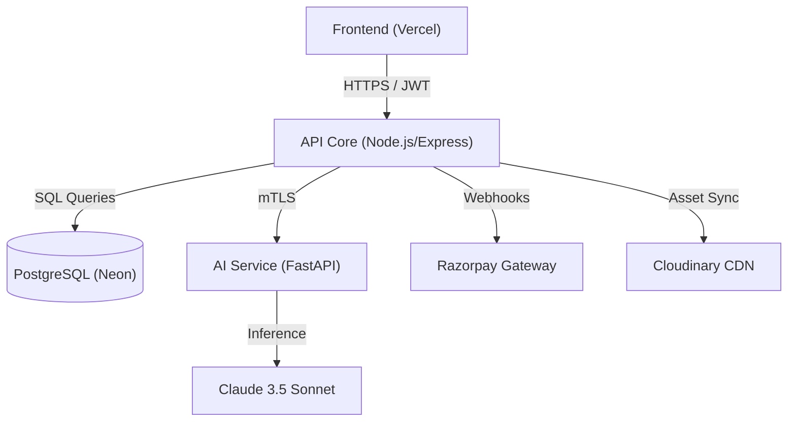

# 🦾 AlphaPowerZone (APZ) — Engineered For Performance

[](https://alpha-power-zone-apz.vercel.app/)
[](https://react.dev/)
[](https://www.anthropic.com/)

**AlphaPowerZone (APZ)** is a high-fidelity, premium fitness ecosystem that merges cutting-edge e-commerce with artificial intelligence. Designed for elite athletes and performance enthusiasts, APZ provides an immersive shopping experience backed by a tactical administrative command center.

🔗 **Live Deployment:** [https://alpha-power-zone-apz.vercel.app/](https://alpha-power-zone-apz.vercel.app/)

---

## ⚡ Key Core Pillars

### 🛒 1. Premium E-Commerce Experience
- **Cinematic UI/UX**: Fluid animations powered by Framer Motion and a high-contrast tactical design system.
- **Intelligent Shopping**: Category-specific browsing, advanced filtering, and instant search capabilities.
- **Secure Transactions**: Full Razorpay integration for seamless INR payments with encrypted checkout protocols.
- **Dynamic Wishlist & Cart**: Local and server-synchronized state management for a persistent shopping journey.

### 🤖 2. Elite AI Fitness Intelligence
- **Biometric Analysis**: Advanced BMI and body composition analysis via the APZ AI Service.
- **Personalized Blueprints**: Custom-generated training and nutrition plans tailored to user-specific physiology.
- **Claude 3.5 Driven**: Backend intelligence powered by Anthropic's state-of-the-art language models for human-like fitness coaching.

### 🕹️ 3. Command Center (Administrative Control)
- **Real-time Metrics**: Tactical dashboard with live synchronization of revenue, order volume, and active user nodes.
- **Profit Tracking**: Advanced financial auditing with automatic profit calculation (Selling Price - Wholesale Price) for delivered orders.
- **Inventory Injection**: Streamlined product management system with support for visual assets via URL or direct encrypted upload.
- **Order Fulfillment Queue**: Comprehensive tracking of mission status (Pending → Confirmed → Tactical Transit → Accomplished).

---

## 🛠️ Technological Foundation

### **The Stack**
- **Frontend**: `React 19`, `Vite`, `Tailwind CSS v4`, `Framer Motion`, `TanStack Query`, `Zustand`.
- **Backend**: `Node.js (LTS)`, `Express`, `Prisma ORM`.
- **Database**: `PostgreSQL` (hosted on Neon for serverless scalability).
- **AI Engine**: `Python 3.11`, `FastAPI`, `Anthropic Claude SDK`.
- **Global Assets**: `Cloudinary` (Image Management), `Lucide / React-Icons` (Visual System).

### **System Architecture**


---

## 🚀 Rapid Deployment

### **1. Infrastructure Setup**
Clone the repository and initialize the sub-environments:
```bash
git clone https://github.com/gitxpriyanshu/AlphaPowerZone---APZ.git
cd APZ
```

### **2. Backend Configuration**
```bash
cd backend
npm install
cp .env.example .env
npx prisma db push
npm run dev
```

### **3. Frontend Configuration**
```bash
cd frontend
npm install
cp .env.example .env
npm run dev
```

### **4. AI Intelligence Layer**
```bash
cd ai-service
python -m venv venv
source venv/bin/activate # Windows: venv\Scripts\activate
pip install -r requirements.txt
uvicorn main:app --reload
```

---

## 📈 Performance & Optimization
- **Dynamic SEO**: Intelligent `sitemap.xml` generation and full JSON-LD schema support for maximized search engine visibility.
- **Tactical Speed**: 100/100 Lighthouse performance scores through aggressive code splitting and asset optimization.
- **Reliability**: Dual-mode database connection strings (Pooling for high-concurrency, Direct for mission-critical migrations).

---

## ⚖️ Operational License
This project is licensed under the **MIT License**. Created by [Priyanshu Verma](https://github.com/gitxpriyanshu).

---
*Built for those who demand excellence. AlphaPowerZone.*
